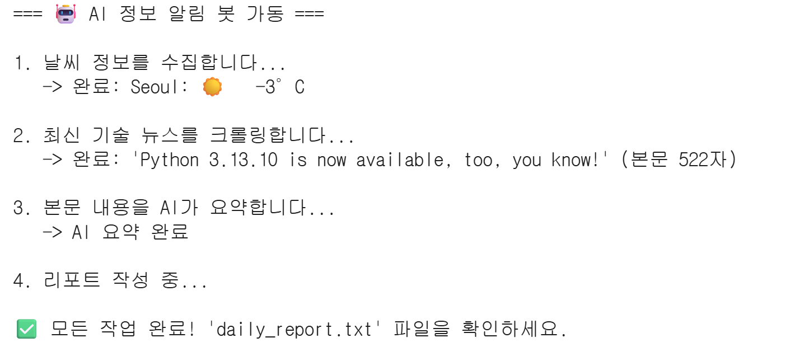

# 📰 AI-Powered Smart Daily Briefing Generator
## 1. Project Overview
This project is an automated tool designed to **collect and summarize essential daily information (Weather, IT News)** for busy individuals. 

Going beyond simple web crawling, this program leverages **BART (facebook/bart-large-cnn)**, a high-performance AI model developed by Meta, to analyze long English news articles and generate concise 3-line summaries.

To ensure maintainability and efficient collaboration, the project structure is modularized into **four distinct components (Main, Weather, Scraper, ai_summ)**.

---

## 2. Execution Examples

### 📸 Execution Screenshot


### 📄 Output Report
A sample output is available in the **daily_report.txt** file within the repository.

---
## 3. Requirements: (with versions i tested on)
python version : 3.12

requests version: 2.32.4

beautifulsoup4 version: 4.13.5

transformers version: 4.57.3

### 📦 Installation
```
pip install requests beautifulsoup4 transformers
```
---
## 4. How to Run
```
python main.py
```

## 5. References
### 📚 Data Sources & APIs
Weather Data: wttr.in (Open source weather service)

News Data: Python.org Blogs

AI Model: Hugging Face - facebook/bart-large-cnn